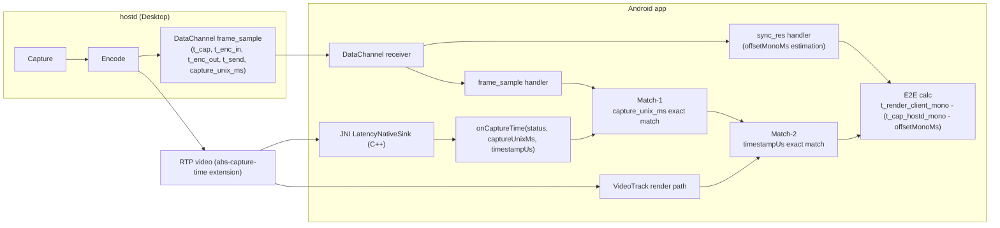
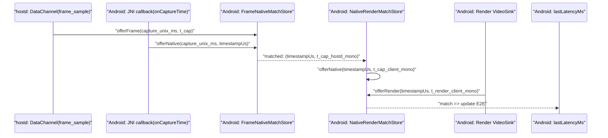

# RemoteRG レイテンシ計測アーキテクチャ（実装詳細）

## 目的
- 現行 E2E レイテンシ計測の内部構造を、実装レベルで共有する
- とくに JNI/C++ 経路の意図と制約を明確化する

## 対象範囲
- 対象は **映像 E2E 計測（C 経路）**
- Input-to-Photon は対象外

## 1. 全体構成



## 2. なぜ JNI が必要か
- Java/Kotlin 側 `VideoFrame` からは `packet_infos.absolute_capture_time` を直接読めない
- `abs-capture-time` は RTP 拡張に載るため、フレーム単位で確実に取るにはデコード後 C++ `VideoFrame` 参照が必要
- そのため `VideoTrack` に独自 C++ `VideoSink` を追加して JNI callback している

## 3. hostd 側データ生成

### 3.1 DataChannel（時刻同期）
- `sync_req` / `sync_res` で NTP風オフセット推定
- 式:
  - `rtt = (c4 - c1) - (s3 - s2)`
  - `offsetMonoMs = ((s2 - c1) + (s3 - c4)) / 2`

### 3.2 DataChannel（frame_sample）
- `frame_sample` で次を送信:
  - `seq`, `frame_id`
  - `t_cap`, `t_enc_in`, `t_enc_out`, `t_send`（hostd monotonic ms）
  - `capture_unix_ms`（突合キー）

### 3.3 RTP 拡張
- `abs-capture-time` を付与（16 byte）
  - `absolute_capture_timestamp` (UQ32.32)
  - `estimated_capture_clock_offset`（現行は 0）

## 4. Android 側計測パイプライン

## 4.1 `offsetMonoMs` 推定
- 5 秒周期で `sync_req`
- 履歴最大 100 件
- RTT 小さい順上位 25% を採用
- 採用 offset の中央値を `alpha=0.1` で平滑化

## 4.2 JNI callback 受信
- Kotlin 側コールバック:
  - `onCaptureTime(status: Int, captureUnixMs: Long, timestampUs: Long)`
- `status`:
  - `0`: ok
  - `1`: no_packet_infos
  - `2`: no_abs_capture_time
  - `3`: out_of_range

## 4.3 2段突合
- 段1 (`FrameNativeMatchStore`):
  - key: `capture_unix_ms`
  - 値: `frame_sample.t_cap` と native `timestampUs`
  - 完全一致のみ、TTL 1000ms
- 段2 (`NativeRenderMatchStore`):
  - key: `timestampUs`
  - 値: `tCapClientMonoMs` と `tRenderClientMonoMs`
  - 完全一致のみ、TTL 1000ms



## 4.4 E2E 算出
- `tCapClientMonoMs = tCapHostdMonoMs - offsetMonoMs`
- `E2E = tRenderClientMonoMs - tCapClientMonoMs`
- `E2E < 0` は警告ログのみ（表示値更新しない）

## 5. JNI/C++ 実装の要点

## 5.1 C++ Sink の抽出処理
- `VideoFrame.packet_infos()` を走査
- `absolute_capture_time` がある要素を探索
- `absolute_capture_timestamp(UQ32.32)` を NTP ms -> Unix ms に変換
- Unix ms 妥当性レンジ（2020-01〜2034-12）外は `out_of_range`
- 成否に関わらず毎フレーム callback（status付き）

## 5.2 JNI スレッド運用
- `JavaVM*` を保持し、`thread_local JNIEnv*` をキャッシュ
- `IncomingVideoSt` での JNI 利用を想定し、通常フレーム処理で `DetachCurrentThread` しない
- callback オブジェクトは `GlobalRef` で保持し、destroy時に解放

## 5.3 Track への attach
- Kotlin `LatencyNativeSink.attachToTrack()` で native sink を生成/再利用
- `VideoTrack.nativeAddSink(nativeTrack, nativeSink)` / `nativeRemoveSink(...)` を利用
- 同一トラック再attachを避け、切替時は detach -> attach

以下は **Android app プロセス内** の JNI Sink ライフサイクル:

```mermaid
stateDiagram-v2
  [*] --> "Detached"
  "Detached" --> "SinkCreated": "nativeCreateLatencySink(callback)"
  "SinkCreated" --> "Attached": "nativeAttachToTrack(track, sink)"
  "Attached" --> "Attached": "onFrame -> CallJava(status, captureUnixMs, timestampUs)"
  "Attached" --> "SinkCreated": "nativeDetachFromTrack(track, sink)"
  "SinkCreated" --> "Destroyed": "nativeDestroySink(sink)"
  "Destroyed" --> [*]
```

## 6. データ構造と責務

## 6.1 `FrameNativeMatchStore`
- 目的: `frame_sample` と native callback の非同期到着を吸収
- `capture_unix_ms` をキーに双方向待ち合わせ

## 6.2 `NativeRenderMatchStore`
- 目的: native 側の `timestampUs` と render フレームを厳密対応
- 近傍マッチは使わず完全一致

## 6.3 更新ポリシー
- UI表示用 `lastLatencyMs` は C 経路マッチ成功時のみ更新
- C 経路でマッチしないフレームはスキップ（前回値維持）
- 旧 B 経路（`frame_sample` 単独）での更新は無効

## 7. ビルド/依存
- Android NDK + CMake で `latency_sink` をビルド
- C++ 側 include:
  - `android/app/src/main/cpp/third_party/webrtc_m124/...`
- Android WebRTC 依存:
  - `io.github.webrtc-sdk:android:125.6422.07`

注意:
- JNI/C++ は WebRTC ABI 変化の影響を受けやすい
- 依存ライブラリ更新時は callback シグネチャ、`VideoSink` vtable、`VideoFrame` API の再確認が必要

## 8. ログとデバッグ観点
- Android:
  - `Latency[sync]`: オフセット推定
  - `Latency[frame_sample]`: hostdメタ受信
  - `Latency[C-native]`: JNI抽出成功後の処理
  - `Latency[C]`: E2E更新
  - `Latency[C-miss]`: その瞬間の未一致（即異常ではない）
  - `Latency[C-evict]` / `Latency[C-clear]`: TTL破棄・クリア時
  - `Latency[C-native-skip]`: 抽出失敗（status付き）
- C++:
  - `ACT frame=...`: 抽出成功統計
  - `ACT skip ... status=...`: 抽出失敗統計

## 9. 既知の制約
- `capture_unix_ms` は突合キー用途（最終計算の時間軸は monotonic）
- 到着順不同を前提に TTL 待ち合わせで吸収
- decode 内訳 (`t_recv`, `t_decode_out`) は主経路では未実装

## 10. 変更時チェックリスト
1. `sync_req/sync_res/frame_sample` の JSON 互換性維持
2. JNI callback シグネチャ `(IJJ)V` の整合
3. `capture_unix_ms` 完全一致、`timestampUs` 完全一致の両段突合維持
4. `offsetMonoMs` が null の間は E2E 更新しない
5. TTL 超過時の eviction ログで欠落率を確認
6. WebRTC 依存更新時は実機で `ACT frame` 継続確認
