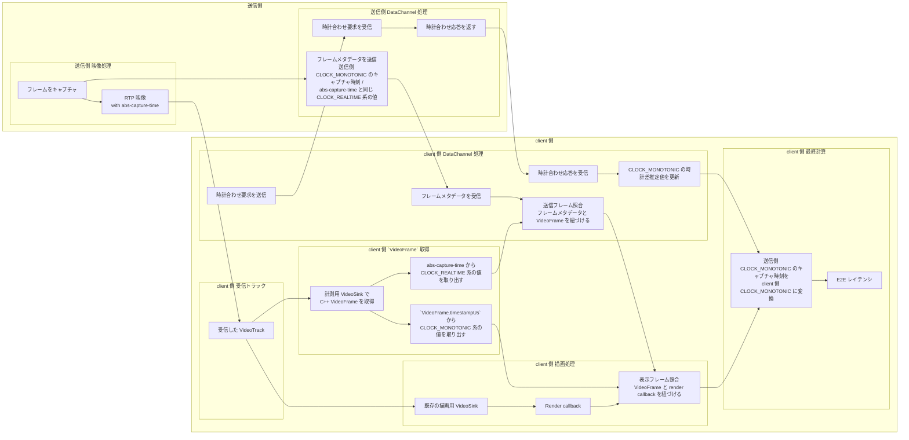

# WebRTC レイテンシ計測記事 構成案

## 記事の主題
- WebRTC ベースの映像配信アプリで、映像 E2E レイテンシを測るためにどのような計測アーキテクチャを設計したかを書く
- 主題は試行錯誤の記録ではなく、**WebRTC のレイテンシ計測で何が難しく、どんな責務分担が必要か**の説明
- 特定の実装の紹介に閉じず、WebRTC の測定系一般に通じる設計原則を持ち帰れる記事にする

## タイトル案
- WebRTC の E2E レイテンシはどう測るのか: フレーム単位計測アーキテクチャの設計
- DataChannel だけでは測れない: フレーム単位 E2E 計測基盤の作り方
- WebRTC の遅延計測を支える、フレーム同定と時間軸統一の設計

## 想定読者
- WebRTC を使ったリアルタイム配信・遠隔操作アプリを実装している人
- Android とネイティブ層をまたいだ計測基盤を設計したい人
- 測定値の意味と成立条件を厳密に扱いたい人

## この記事で前に出したい価値
- WebRTC で遅延を測る難しさは、計算式そのものではなく**フレーム同定**にある
- DataChannel と RTP が別経路である以上、測定系にもアーキテクチャが要る
- Java API だけでは完結しないため、**どこで `VideoFrame` を取得するか**まで設計しないといけない

## Abstract
WebRTC ベースの映像配信アプリで E2E レイテンシを測ろうとすると、単に送受信の時刻を記録するだけでは足りない。送信側で取得したフレームと、受信側で表示されたフレームを正しく対応づけ、さらに両者を同じ時間軸で比較する必要があるからだ。

しかし WebRTC では、映像本体は RTP、補助的なメタデータは DataChannel と経路が分かれている。加えて Android の Java API だけでは、フレーム同定に必要な情報を十分に取得できない。そこで本稿では、時刻同期、フレーム同定、ネイティブでの `VideoFrame` 取得、最終計算を分離した計測アーキテクチャを扱う。その全体像と、なぜその役割分担が必要になるのかを説明する。

補足:
- 本稿で扱う E2E は、成立条件を満たして対応づけできたフレームに対する厳密な測定値であり、すべてのフレームに対する近似値ではない

## 1. 何を測りたかったのか

### 1.1 測りたいもの
- 測りたいのは、送信側でキャプチャされたフレームが Android クライアントで表示されるまでの時間
- 起点は送信側のキャプチャ時刻
- 終点は受信側の描画時刻
- つまり知りたいのは、あるフレームが「取られてから表示されるまで」の時間

### 1.2 でも難しいのは引き算そのものではない
- やりたいこと自体は「表示された時刻から、取られた時刻を引く」だけに見える
- しかし実際には、送信側のキャプチャ時刻と受信側の描画時刻をそのまま比較できない
- 加えて、送信側で記録した時刻と受信側で取得したフレームを簡単に紐づけることもできない
- 計測を成立させるには、次の 2 条件が必要になる
  - その 2 つの時刻を**同じ時間軸**で比較できること
  - 送信側と受信側で**同じフレーム**を見つけられること

## 2. なぜ素朴には測れないのか

### 2.1 送信側と Android の時計は別
- キャプチャ時刻は送信側の monotonic
- 描画時刻は Android の monotonic
- そのままでは引き算できない
- だから clock offset を別途推定する必要がある

### 2.2 同じフレームを特定することが難しい
- E2E レイテンシは、送信側でそのフレームがいつキャプチャされたかと、受信側でそのフレームがいつ表示されたかの差なので、まず両者が同じフレームを指している必要がある
- 素朴に考えると、Android 側で見えている 1 枚のフレームに対して、「いつのフレームなのか」と「いつ描画されたのか」を結び付けられれば十分に見える
- しかし Android アプリケーションコードから見えているのは、libwebrtc の C++ 側で扱われているフレーム情報のうち Java API へ公開されている部分だけである
- 今回ほしかった送信側 capture 時刻に由来する情報はその公開範囲には含まれていない
- そのため、表示直前のフレームは見えても、それが送信側でいつキャプチャされたフレームなのかは Java API だけでは分からない
- 主計測値を成立させるには、C++ 側で保持されているフレーム情報を取得できる、より下位の層を扱う必要がある

## 3. 採用した計測パイプラインの全体像

### 3.1 計測値が成立するまでの流れ
- この計測では、時計合わせとフレーム合わせが別々に進み、最後に合流する
- DataChannel だけでも RTP だけでも完結しない
- だから、最初に「どの情報がどの経路を流れ、どこで紐づくか」を全体図で示す

### 3.2 図の理解に必要な前提
- 1. `CLOCK_MONOTONIC` と `CLOCK_REALTIME` の違い
  - ここは最重要の前提として先に説明する
  - `CLOCK_REALTIME` は壁時計に近い時刻で、NTP などで補正されうる
  - `CLOCK_MONOTONIC` は単調増加する経過時間用の時刻で、レイテンシ計測に向く
  - 今回の計測では、送信側メタデータにこの 2 系統の情報が混在している
  - そのため client 側では、送信側 `CLOCK_MONOTONIC` を client 側 `CLOCK_MONOTONIC` へ写像する必要がある
  - 後述する `abs-capture-time` には絶対時刻系の値が載る仕様なので、送信フレーム照合では `CLOCK_REALTIME` 系の値を使っている
  - 読者に最初に伝えたいのは、「時刻が 2 種類ある」のではなく、「役割の異なる時間軸が 2 つある」ということ
- 2. `abs-capture-time` が何者か
  - `abs-capture-time` は RTP header extension である
  - 送信側でいつキャプチャされたかに対応する絶対時刻系の情報を RTP の映像パケットに載せて運ぶ
  - ここに入るのは絶対時刻系の値であり、送信フレーム照合では `CLOCK_REALTIME` 系の値として使える
  - 図の理解に必要なのは、「なぜ映像パケットから `CLOCK_REALTIME` 系の値が取れるのか」という点であり、その答えが `abs-capture-time` である
  - あわせて、DataChannel で送るフレームメタデータにも、送信フレーム照合のためにこれと同じ値を入れていることを明示する
- 3. DataChannel を何に使っているのか
  - DataChannel では 2 種類の情報をやり取りする
  - ひとつは時計合わせメッセージの送受信
  - もうひとつは、送信側 `CLOCK_MONOTONIC` のキャプチャ時刻と、送信フレーム照合に使う `abs-capture-time` と同じ `CLOCK_REALTIME` 系の値を含むフレームメタデータの受信
- 4. 「時計合わせ要求 / 応答」で何を推定しているのか
  - sender と client は別マシンなので、`CLOCK_MONOTONIC` の値は直接比較できない
  - そのため DataChannel の往復で、送信側 `CLOCK_MONOTONIC` と client 側 `CLOCK_MONOTONIC` のオフセットを推定する
  - やっていることは NTP と同型の時計合わせであり、往復時間を使ってオフセットを見積もる
  - 必要なら RTT の半分を使う近似で offset を推定する
  - 図の「送信側 `CLOCK_MONOTONIC` のキャプチャ時刻を client 側 `CLOCK_MONOTONIC` に変換」が成り立つ前提がこの時計差である
- 5. フレーム照合が何を意味しているのか
  - 送信フレーム照合では、DataChannel で送ったフレームメタデータと、計測用 `VideoSink` で取得した `VideoFrame` を紐づける
  - 表示フレーム照合では、先ほどの `VideoFrame` と、実際に表示段階へ進んだ render callback を紐づける
  - これにより、「送信時刻」と「表示時刻」を同一フレーム単位で対応づけられる
  - frame ID を単純に直接使うというより、送信フレーム照合では `abs-capture-time` と同じ `CLOCK_REALTIME` 系の値を使い、表示フレーム照合では `VideoFrame.timestampUs` 由来の `CLOCK_MONOTONIC` 系の値を使う
  - 一致しないフレームまで無理に計算しないという方針も、ここで触れておくと分かりやすい
- 6. `VideoTrack` / `VideoSink` / `VideoFrame` / render callback の関係
  - WebRTC 実装に不慣れな読者向けに、ここは先に交通整理する
  - client 側では `VideoTrack` を受け、その先で複数の `VideoSink` にフレームを渡せる
  - 今回は
    - C++ 側で直接 `VideoFrame` を受け取る計測用 `VideoSink` の経路
    - 既存の描画用 `VideoSink` から render callback へ進む経路
    の 2 つを並行に持っている
  - そして最後に、その 2 つの経路を表示フレーム照合で同一フレームへ再び紐づける
- 7. `VideoFrame.timestampUs` が何の時刻なのか
  - 名前だけでは送信時刻に見えやすいので、ここで明示する
  - これは client 側で受信後に扱う `VideoFrame` に載っている時刻であり、送信側キャプチャ時刻そのものではない
  - 本稿では、表示フレーム照合に使う client 側 `CLOCK_MONOTONIC` 系のフレーム時刻として扱う
- 記事中では内部変数名をそのまま見せず、次の呼び方を使う
  - `t_cap`: 送信側 `CLOCK_MONOTONIC` のキャプチャ時刻
  - `offsetMonoMs`: 送信側 `CLOCK_MONOTONIC` と client 側 `CLOCK_MONOTONIC` の時計差推定値
  - `capture_unix_ms`: 送信フレーム照合に使う `abs-capture-time` と同じ `CLOCK_REALTIME` 系の値
  - `timestampUs`: 表示フレーム照合に使う client 側 `CLOCK_MONOTONIC` 系のフレーム時刻
  - `frame_sample`: フレームメタデータ
  - `sync_req` / `sync_res`: 時計合わせメッセージ

### 3.3 mermaid 図
- 図の意図:
  - 時計合わせの系統とフレーム同定の系統が並行して進み、最後に E2E 計算へ合流することを一目で見せる
  - DataChannel 上で流れる「時計合わせメッセージ」と「フレームメタデータ」を分けて描く
  - `sync_req` と `sync_res` の往復がないと時計差推定値が作れないことを図に含める
  - 各処理が送信側と client 側のどちらで実行されるかを分かるようにする
- mermaid 案:

この図は、
- DataChannel で時計差を推定する経路
- RTP / `VideoTrack` 経由でフレームを受け取る経路
- 描画直前の callback で表示時刻を取得する経路
の 3 本を最後に合流させて、送信側キャプチャ時刻を client 側時刻へ変換し、E2E レイテンシを求める流れを表している。

読むときは、まず時計合わせ（`CDC1`〜`CDC3`）、次にフレーム受信と照合（`SV1`〜`CDC5`, `CV1`〜`CV3`）、最後に描画との照合と最終計算（`CR1`〜`CC2`）の順に追うと分かりやすい。

## 4. パイプラインの各段をどう実装したか

### 4.1 時刻同期: DataChannel
- 入力:
  - 時計合わせ用の往復メッセージ
- 出力:
  - 送信側 `CLOCK_MONOTONIC` と client 側 `CLOCK_MONOTONIC` の時計差推定値
- 保証:
  - 送信側 `CLOCK_MONOTONIC` と Android 側 `CLOCK_MONOTONIC` を対応づけるための基準を作る
- 非保証:
  - これだけではフレーム同定はできない
- 実装では:
  - `sync_req` / `sync_res`
  - `offsetMonoMs`
- 参照実装:
  - `desktop/services/core/src/lib.rs`
  - `desktop/services/webrtc/src/connection.rs`
  - `android/app/src/main/java/moe/ryoha/remoterg/webrtc/LatencyMonotonicMath.kt`
- 一般化:
  - 補助経路で時計同期を行い、本流とは別に時間軸対応を作る分離は、他の WebRTC 系でも応用しやすい

### 4.2 フレーム同定のための送信側メタデータ
- 入力:
  - 送信側 `CLOCK_MONOTONIC` のキャプチャ時刻
  - 送信側 `CLOCK_MONOTONIC` のエンコード投入時刻
  - 送信側 `CLOCK_MONOTONIC` のエンコード完了時刻
  - 送信側 `CLOCK_MONOTONIC` の送信時刻
- 出力:
  - DataChannel 上のフレームメタデータ
  - 送信フレーム照合に使う `abs-capture-time` と同じ `CLOCK_REALTIME` 系の値
- 保証:
  - 送信側 `CLOCK_MONOTONIC` 起点のキャプチャ時刻を受信側まで運ぶ
  - JNI 経路との紐づけキーを与える
- 非保証:
  - これ単独では「その映像フレーム」との 1:1 対応は保証しない
- 実装では:
  - `frame_sample`
  - `t_cap`, `t_enc_in`, `t_enc_out`, `t_send`
  - `capture_unix_ms`
- 参照実装:
  - `desktop/services/core/src/lib.rs`
  - `desktop/services/webrtc/src/connection.rs`
- 一般化:
  - 本流と補助経路の情報を分けて運び、後段で紐づける構成は計測系を安定させやすい

### 4.3 映像本流からのフレーム同定
- 入力:
  - 送信フレームに付与された `abs-capture-time`
- 出力:
  - RTP extension 上の `CLOCK_REALTIME` 系の値
- 保証:
  - DataChannel とは別に、映像本流から送信フレーム照合に使う `CLOCK_REALTIME` 系の値を得られる
- 非保証:
  - Android Java API だけでは直接取得できない
- 実装では:
  - `abs-capture-time`
- 参照実装:
  - `desktop/services/video-stream/src/track_writer.rs`
  - `desktop/services/webrtc/src/connection.rs`
- 一般化:
  - 補助経路ではなく映像本流からフレーム由来の情報を取ることが、E2E 計測の信頼性を上げる

### 4.4 ネイティブ側ビデオシンクで `VideoFrame` を取得する
- 入力:
  - C++ `VideoFrame`
- 出力:
  - `abs-capture-time` に由来する `CLOCK_REALTIME` 系の値
  - `VideoFrame.timestampUs` に由来する `CLOCK_MONOTONIC` 系のフレーム時刻
- 保証:
  - Java API では見えない `packet_infos.absolute_capture_time` を取得できる
- 非保証:
  - これ単体では render との対応も E2E も確定しない
- 実装では:
  - `captureUnixMs`
  - `timestampUs`
- 参照実装:
  - `android/app/src/main/cpp/latency_sink.cpp`
  - `android/app/src/main/java/moe/ryoha/remoterg/webrtc/LatencyNativeSink.kt`
- 一般化:
  - Java API で必要情報が取れない場合、取得位置を lower layer に置くのは再利用しやすい設計原則になる

### 4.5 フレーム同定: 送信フレーム照合と表示フレーム照合
- 送信フレーム照合:
  - 入力: DataChannel 側メタデータの `CLOCK_REALTIME` 系の値と、native callback 側の `CLOCK_REALTIME` 系の値
  - 出力: 送信側 `CLOCK_MONOTONIC` のキャプチャ時刻と、`VideoFrame.timestampUs` 由来の `CLOCK_MONOTONIC` 系フレーム時刻の組
  - 保証: 送信側のフレーム情報と `VideoFrame` を紐づける
- 表示フレーム照合:
  - 入力: `VideoFrame.timestampUs` 由来の `CLOCK_MONOTONIC` 系フレーム時刻と、render 側の `CLOCK_MONOTONIC` 系フレーム時刻
  - 出力: client 側 `CLOCK_MONOTONIC` の描画時刻と紐づいたフレーム
  - 保証: 実際に render されたフレームへ紐づける
- 非保証:
  - 一致しないフレームは無理に計算しない
- 実装では:
  - 送信フレーム照合キー: `capture_unix_ms` / `captureUnixMs`
  - 表示フレーム照合キー: `timestampUs`
- 参照実装:
  - `android/app/src/main/java/moe/ryoha/remoterg/webrtc/FrameNativeMatchStore.kt`
  - `android/app/src/main/java/moe/ryoha/remoterg/webrtc/WebRtcManager.kt`
- 一般化:
  - 異なる経路の情報を1つのキーで無理に合わせず、段階的に対応づけるほうが安定する

### 4.6 最終計算: monotonic に揃えて E2E を出す
- 入力:
  - 送信側 `CLOCK_MONOTONIC` のキャプチャ時刻
  - `CLOCK_MONOTONIC` の時計差推定値
  - client 側 `CLOCK_MONOTONIC` の描画時刻
- 出力:
  - E2E レイテンシ
- 保証:
  - 最終値の時間軸を `CLOCK_MONOTONIC` に揃えられる
- 非保証:
  - display の実発光時刻までは表していない
- 実装では:
  - `tCapSenderMonoMs`
  - `offsetMonoMs`
  - `tRenderClientMonoMs`
- 一般化:
  - 送信フレーム照合に便利な `CLOCK_REALTIME` 系の値と、最終計算に向く `CLOCK_MONOTONIC` を分離するのは、時間軸が混在する計測で有効

## 5. この設計で何が測れて、何が測れないか

### 5.1 測れているもの
- 送信側の capture から Android の render callback までの E2E
- `frame_sample` が持つ encode 周辺の補助指標
- 成立条件を満たしたフレームについての厳密な E2E

### 5.2 測っていないもの
- 実ディスプレイの発光時刻そのもの
- 成立条件を満たさなかったフレームの E2E
- `abs-capture-time` 欠落や突合失敗を含む全フレーム一律の値

### 5.3 重要な姿勢
- 「すべてのフレームをざっくり測る」より
- 「成立条件を満たしたフレームだけを厳密に測る」を優先する
- 計測記事としては、ここを明示したほうが信頼される

## 6. 実装上の注意点

### 6.1 absolute time はキー用途に限定する
- `CLOCK_REALTIME` 系の値はフレーム同定には便利
- ただし最終 E2E を `CLOCK_REALTIME` 系の値同士の差で持つと基準がぶれやすい
- だから `CLOCK_REALTIME` 系の値は橋渡しに限定し、最終値は `CLOCK_MONOTONIC` で計算する
- 実装では:
  - `capture_unix_ms`

### 6.2 デコーダ側フレーム時刻は表示フレーム照合専用にする
- Java から見えるデコーダ側フレーム時刻は、送信側の capture 時刻そのものではなく client 側 `CLOCK_MONOTONIC` 系の値である
- render 側との紐づけには使える
- ただし送信側起点の時刻とみなしてはいけない
- 実装では:
  - `timestampNs` / `timestampUs`

### 6.3 Java デコーダラップを主経路にしない
- `WrappedNativeVideoDecoder` のように、Java ラップを主経路にできないケースがある
- だからデコーダ内部ではなく、デコード後 `VideoFrame` を取得する構成にしている

### 6.4 JNI sink は ABI 整合まで含めて責任を持つ
- C++ 側の取得点を使う以上、ABI 整合も設計責任に入る
- 特に ARM 実機では relative vtable ABI への注意が必要だった
- ただし本文では主軸にしすぎず、実装コラム寄りに扱う
- 参照実装:
  - `android/app/src/main/cpp/CMakeLists.txt`
  - `android/app/build.gradle.kts`

## 7. まとめ

### 7.1 記事の結論候補
- WebRTC の E2E レイテンシ計測で最初に解くべき問題は、計算式ではなくフレーム同定である
- DataChannel と RTP が別経路である以上、測定系にも役割分担が必要になる
- その制約を分解すると
  - `CLOCK_MONOTONIC` の時刻同期は DataChannel
  - フレーム同定は RTP `abs-capture-time` と同じ `CLOCK_REALTIME` 系の値
  - `VideoFrame` の取得は JNI `VideoSink`
  - 最終計算は `CLOCK_MONOTONIC`
  という構成が自然に導かれる

### 7.2 記事の価値
- 「ある実装ではこうした」だけでなく
- 「WebRTC のレイテンシ計測では、なぜその責務分担が必要になるのか」を説明できる

## 8. 記事内で入れたい図
- 図1: 採用アーキテクチャ全体図
- 図1 は mermaid で先に出してもよい
- 時計合わせの系統とフレーム同定の系統が並行し、最後に合流する形を明示する
- 図2: 2 段突合のシーケンス図
- 図3: 時間軸の整理
  - 送信側 `CLOCK_MONOTONIC`
  - client 側 `CLOCK_MONOTONIC`
  - `abs-capture-time` と同じ `CLOCK_REALTIME` 系の値
- 図4: Java API と C++ `VideoFrame` の見える情報の差
- 図5: JNI sink を入れたときの `VideoFrame` 取得位置と責務範囲

## 9. 章ごとに差し込むコード参照候補
- `desktop/services/core/src/lib.rs`
  - `DataChannelMessage::SyncReq`
  - `DataChannelMessage::SyncRes`
  - `DataChannelMessage::FrameSample`
- `desktop/services/webrtc/src/connection.rs`
  - header extension の登録
  - `sync_res` 応答
- `desktop/services/video-stream/src/track_writer.rs`
  - `write_sample_with_extensions`
  - `AbsCaptureTimeExtension`
- `android/app/src/main/java/moe/ryoha/remoterg/webrtc/LatencyMonotonicMath.kt`
  - offset 推定式
- `android/app/src/main/java/moe/ryoha/remoterg/webrtc/WebRtcManager.kt`
  - `handleSyncRes`
  - `handleFrameSample`
  - `deliverMatchedFrameNative`
  - `onFrameRendered`
- `android/app/src/main/java/moe/ryoha/remoterg/webrtc/FrameNativeMatchStore.kt`
  - 送信フレーム照合
  - 表示フレーム照合
- `android/app/src/main/java/moe/ryoha/remoterg/webrtc/LatencyNativeSink.kt`
  - sink attach / detach
- `android/app/src/main/cpp/latency_sink.cpp`
  - `ExtractCaptureTimeFromFrame`
  - JNI callback
- `android/app/src/main/cpp/CMakeLists.txt`
  - ARM ABI 対応

## 10. 仕上げ時のチェックリスト
- [ ] 冒頭で「何がそんなに難しいのか」が人間語で伝わる
- [ ] 素朴な方法がどこで壊れるかを序盤で示している
- [ ] 用語の交通整理が早い段階で済んでいる
- [ ] 計測値が成立するまでのパイプラインを先に示してから実装説明に入っている
- [ ] 全体図を早めに出している
- [ ] 章立てが `問題設定 -> 素朴には測れない理由 -> 全体パイプラインと図 -> 各段の実装 -> 測定範囲 -> 実装上の注意 -> まとめ` になっている
- [ ] 送信側 `CLOCK_MONOTONIC`、`abs-capture-time` と同じ `CLOCK_REALTIME` 系の値、ネイティブでの `VideoFrame` 取得、2 段の照合、`CLOCK_MONOTONIC` ベースの最終計算が、どこで流れ、どこで合流するか説明されている
- [ ] 失敗談が日記ではなく設計制約の説明になっている
- [ ] 「何が測れて何が測れないか」が明示されている
- [ ] 固有実装の説明に、一般化できる一文を適宜添えている

## 付録候補

### 付録A. libwebrtc と Android の API 事情
- `Android Java API` が何を指しているのかを明確にする
- libwebrtc 本体は C++ 実装であり、Java API はその一部を JNI 越しに扱う窓口であることを説明する
- `VideoFrame` から見える情報と C++ 側で保持している情報の差を説明する
- `absolute_capture_time` や `packet_infos` が Java API から直接扱えない背景を補足する
- `org.webrtc` を直接使う場合と、その上にラッパーや SDK を重ねる場合で API の見え方がさらに変わりうることを補足する
- 「Java API から取れない」とは、Android アプリケーションコードから通常アクセスできる公開 API だけでは足りなかった、という意味だと明記する
