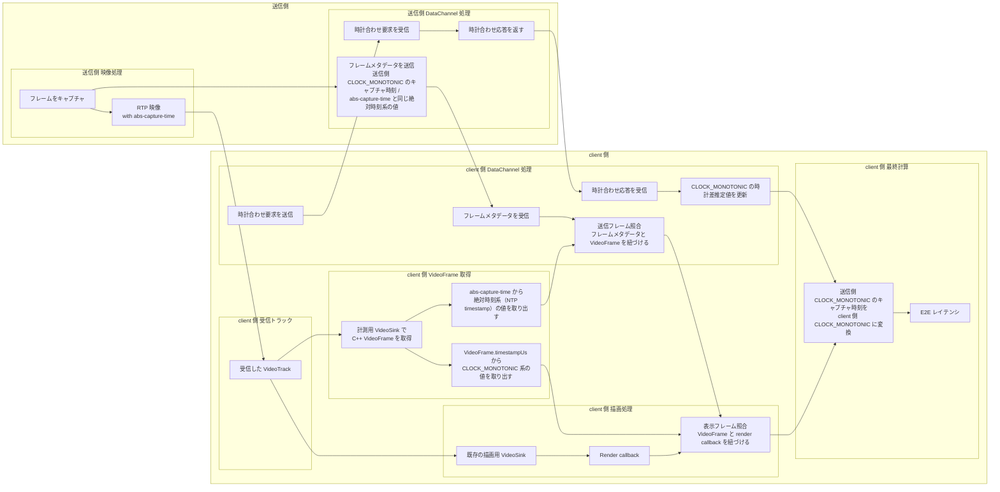

# WebRTC の E2E レイテンシはどう測るのか: フレーム単位計測アーキテクチャの設計

## はじめに

こんにちは、田中です。ポケットサインでエンジニアとして働いています。普段は「ポケットサイン防災」という Web アプリの開発をしています。

その一方で、趣味として WebRTC を用いた PC と Android 間の画面共有システムを作っています。このシステムでは、PC 側の画面を Android 端末に配信し、離れた端末から操作できるようにしています。

この種のシステムでは、体感の良し悪しを議論するうえで、遅延の把握が欠かせません。そこで今回は、そのシステムにおける映像の end-to-end レイテンシをどのように測るか、そのためにどのような計測アーキテクチャを設計したかを紹介します。

## 1. 何を測りたかったのか

本稿で測りたかったのは、送信側でキャプチャされたフレームが Android クライアントで表示されるまでの時間です。起点は送信側のキャプチャ時刻、終点は受信側の描画時刻です。ただし厳密には、実画面への反映完了時刻ではなく、render callback が呼ばれた時刻を表示時刻の近似として用いています。ネットワークだけでなく、エンコード、伝送、デコード、描画までを含めた end-to-end の時間を対象にします。

単純に考えれば、描画時刻からキャプチャ時刻を引くだけです。ただし実際に計測しようとすると、送信側のキャプチャ時刻と受信側の描画時刻はそのままでは比較できません。加えて、後述する Java API の問題によって、送信側で記録した時刻と受信側で観測したフレームを簡単に結び付けることもできません。計測を成立させるには、少なくとも次の 2 つの条件が必要です。

1. その 2 つの時刻を同じ時間軸で比較できること
2. 送信側と受信側で同じフレームを対応付けられること

前者は時刻同期の問題であり、後者はフレーム同定の問題です。WebRTC の E2E レイテンシ計測では、この 2 つを同時に満たす必要があります。次章では、なぜ素朴な方法ではそれが難しいのかを整理します。

## 2. なぜ素朴には測れないのか

### 2.1 送信側と受信側の時刻はそのままでは比較できない

最初の問題は時間軸です。送信側で記録するキャプチャ時刻と、Android クライアントで記録する描画時刻は、別のデバイスで取得された時刻であり、同じ基準でそのまま比較することはできません。

この状態では、送信側で得た値を受信側の値からそのまま引くことはできません。E2E レイテンシを計算するには、まず送信側の時刻を受信側の時間軸に対応付ける必要があります。

### 2.2 同じフレームを特定することが難しい

次の問題はフレーム同定です。E2E レイテンシは「送信側でそのフレームがいつキャプチャされたか」と「受信側でそのフレームがいつ表示されたか」の差なので、まず両者が同じフレームを指している必要があります。

素朴に考えると、Android 側で「いま描画されようとしているフレーム」を見つけて、そのフレームが送信側でいつキャプチャされたものなのかが分かれば十分に見えます。つまり、受信側で見えている 1 枚のフレームに対して、「いつのフレームなのか」と「いつ描画されたのか」を結び付けられればよさそうです。

しかし、Android アプリケーションコードから見えているのは、libwebrtc の C++ 側で扱われているフレーム情報のうち、Java API へ公開されている部分だけです。少なくとも今回利用していた Android 側の Java API（`org.webrtc.VideoFrame`）からは、`abs-capture-time` 由来の情報やそれに準ずる照合キーを直接取得できませんでした。

つまり、Java 側では「いま描画されようとしているフレーム」は見えても、それが送信側でいつキャプチャされたフレームなのかまでは分かりません。そのため、フレーム同定を成立させるには、C++ 側で保持されているフレーム情報を取得できる、より下位の層を扱う必要がありました。

## 3. 採用した計測パイプラインの全体像

### 3.1 計測値が成立するまでの流れ

この計測では、時計合わせとフレームの対応付けが別々に進み、最後に合流します。DataChannel だけでも RTP だけでも完結しません。DataChannel だけでは実際に描画された映像フレームそのものを追えず、RTP / `VideoFrame` 側だけでは送信側 `CLOCK_MONOTONIC` と受信側 `CLOCK_MONOTONIC` の橋渡しができないためです。そのため、先に「どの情報がどの経路を流れ、どこで同じフレームへ紐づくか」を全体図で示します。



この図は、DataChannel で時計差を推定する経路、RTP と `VideoTrack` を通ってフレームを受け取る経路、描画直前の callback で表示時刻を取得する経路の 3 本を最後に合流させて、E2E レイテンシを求める流れを表しています。図中の処理は、時計合わせ、フレーム受信と照合、描画との照合と最終計算の順に進みます。

### 3.2 図の理解に必要な前提

- `CLOCK_MONOTONIC` と絶対時刻系（NTP timestamp）の違い
  - この図を読むうえで最も重要なのは、時間軸が 2 つあること。
  - `CLOCK_MONOTONIC` は単調増加する経過時間用の時刻。レイテンシ計測の最終計算にはこちらを使う。
  - 絶対時刻系（NTP timestamp）は壁時計に近い時刻体系であり、後述する `abs-capture-time` がこの時計系に基づく。実装上は OS の `CLOCK_REALTIME` から導いた値を使った。
  - 本計測では、送信側でも `abs-capture-time` と同じ絶対時刻系の値をフレームメタデータとして保持し、受信側で照合に用いた。

- `abs-capture-time` が何者か
  - `abs-capture-time` は RTP header extension。
  - 仕様上は、パケット内の最初の映像フレームが最初にキャプチャされた時点の NTP timestamp である。受信フレームの capture 時刻を推定するために使える絶対時刻系の情報として、本計測では送信フレーム照合に利用した。実装上は、送信側で `CLOCK_REALTIME` から導いた値を使った。
  - client 側で、C++ 側の `VideoFrame` を直接受け取る計測用 `VideoSink` を追加すると、この値に由来する情報を取り出せる。
  - DataChannel で送るフレームメタデータにも、送信フレーム照合のためにこれと同じ絶対時刻系の値を含める。

- DataChannel を何に使っているのか
  - DataChannel では 2 種類の情報をやり取りする。
  - ひとつは時計合わせメッセージの送受信。
  - もうひとつは、送信側 `CLOCK_MONOTONIC` のキャプチャ時刻と、送信フレーム照合に使う絶対時刻系の値を含むフレームメタデータの受信。

- 時計合わせ要求 / 応答で何を推定しているのか
  - sender と client は別マシンなので、両者の `CLOCK_MONOTONIC` はそのまま比較できない。
  - そのため DataChannel の往復でオフセットを求め、送信側 `CLOCK_MONOTONIC` を client 側 `CLOCK_MONOTONIC` に写像できるようにする。
  - やっていることは NTP と同型の時計合わせであり、往復時間を使ってオフセットを見積もる。
  - 図の「送信側 `CLOCK_MONOTONIC` のキャプチャ時刻を client 側 `CLOCK_MONOTONIC` に変換」が成り立つ前提がこの時計差。

- フレーム照合が何を意味しているのか
  - フレーム照合は 2 段ある。
  - 送信フレーム照合
    - DataChannel で受け取ったフレームメタデータと、計測用 `VideoSink` で取得した `VideoFrame` を紐づける。
    - ここで使うのは `abs-capture-time` と同じ絶対時刻系の値。
    - これにより、送信側 `CLOCK_MONOTONIC` のキャプチャ時刻を、その `VideoFrame` に紐づけられる。
  - 表示フレーム照合
    - 送信フレーム照合で紐づいた `VideoFrame` と render callback を紐づける。
    - ここで使うのが `VideoFrame.timestampUs` に由来する `CLOCK_MONOTONIC` 系の値。
  - この 2 段を通すことで、「送信時刻」と「表示時刻」を同一フレーム単位で対応付けられる。

- `VideoTrack` / `VideoSink` / `VideoFrame` / render callback の関係
  - libwebrtc は受信した映像を `VideoTrack` として扱い、その先で複数の `VideoSink` にフレームを渡せる。
  - 今回のアプリでは、その `VideoTrack` に対して 2 つの経路を並行に持つ。
    - C++ 側で直接 `VideoFrame` を受け取る計測用 `VideoSink`
    - 既存の描画用 `VideoSink` から render callback へ進む経路
  - この 2 経路で同じ `timestampUs` を共有している前提で、最後に表示フレーム照合で同じフレームへ紐づける。

- `VideoFrame.timestampUs` が何の時刻なのか
  - `VideoFrame.timestampUs` は、C++ API 上では単調時間系（`TimeMicros()` と同じ timebase）のタイムスタンプである。
  - 送信側のキャプチャ時刻そのものではないため、送信フレーム照合には使わない。
  - この計測では、`VideoFrame.timestampUs` を表示フレーム照合を行うためのキーとして利用した。

## 4. Java API の外で `VideoFrame` を取得する

### 4.1 Java API だけでは必要な情報をそろえられない

第3章で整理したとおり、この計測を成立させるには 2 種類のキーが必要です。ひとつは DataChannel で届いたフレームメタデータと受信フレームを結び付けるための送信フレーム照合キー、もうひとつは受信フレームと render callback を結び付けるための表示フレーム照合キーです。

後者については、Android アプリケーションコードから扱える `VideoFrame` や render callback の情報で足ります。しかし前者に必要な `abs-capture-time` 由来の値は、少なくとも今回利用していた Android 側の Java API からは直接取得できませんでした。render callback 側で見えているのは、描画に進む段階のフレームであって、そのフレームが送信側でどの時刻にキャプチャされたものかを示す情報ではないためです。

そのため、Java 側だけで計測を完結させる構成は取りませんでした。必要だったのは、受信した `VideoFrame` に対して、送信フレーム照合に使う値と、表示フレーム照合に使う `timestampUs` を同時に扱える場所です。今回の実装では、その役割を C++ 側の `OnFrame` に持たせました。

計測用 `VideoSink` の `OnFrame` では、送信フレーム照合に必要な値と `VideoFrame.timestamp_us()` を同じフレームから取得し、Kotlin 側へコールバックします。こうすることで、送信側のメタデータと結び付けるための情報と、render callback 側と結び付けるための情報を、同一フレーム単位で扱えます。

そのため、既存の描画経路とは別に、計測専用の `VideoSink` を `VideoTrack` へ追加しました。受信した映像はもともと描画用の `VideoSink` に流れていますが、その経路を置き換えるのではなく、同じ `VideoTrack` から計測用の経路を分けています。

アプリケーションコードで受け取った `VideoTrack` に対して、C++ で実装した計測用 `VideoSink` を追加すると、`OnFrame` で `VideoFrame` を直接受け取れます。これにより、送信フレーム照合に使う値と `timestampUs` を、render callback より手前の段階で同じフレームから取得できます。render callback 側はそのまま残るため、表示フレーム照合の流れは変わりません。

ここで必要だったのは、WebRTC の公開 API を変更することではなく、受信トラックから計測用の経路をもうひとつ分けることでした。描画用 `VideoSink` と計測用 `VideoSink` は同じ `VideoTrack` を共有しますが、役割は分かれています。前者は表示のために使い、後者はフレーム照合に必要な情報を取り出すために使います。

### 4.2 配布済みの WebRTC ライブラリへどう組み込むか

ここまでで必要なのは、C++ で実装した計測用 `VideoSink` を、Android アプリが使っている `org.webrtc` の `VideoTrack` に接続することだと分かりました。そこで次に問題になるのが、配布済みの WebRTC ライブラリへ、こちらの C++ コードをどう組み込むかです。

ここで使う JNI は、Java や Kotlin から C++ の関数を呼び出したり、逆に C++ から Java や Kotlin のメソッドを呼び出したりするための仕組みです。この実装では、Kotlin 側から JNI を通じて C++ の計測用 `VideoSink` を生成し、それを `VideoTrack` へ接続しています。

またこの実装で扱っている `org.webrtc` は、Android 向けに配布されている WebRTC ライブラリです。アプリケーションコードはその Java API を使って `PeerConnection` や `VideoTrack` を扱いますが、内部ではネイティブライブラリが動いています。

ここで取り得る方法は大きく 2 つあります。ひとつは WebRTC 本体を自前でビルドし、必要な情報を Java API へ出せるように改造したうえで、その改造版をアプリへ組み込む方法です。もうひとつは、配布済みのライブラリはそのまま利用しつつ、アプリ側で追加した C++ コードだけを別ライブラリとしてビルドし、既存の `VideoTrack` に接続する方法です。今回は後者を選びました。

前者の方法では、必要な情報を Java 側から直接扱えるようにできますが、WebRTC 本体のビルド、改造差分の維持、ライブラリ更新時の追従が継続的に必要になります。今回必要だったのは、受信フレームから特定の情報を取り出すための処理であり、受信、デコード、描画の全体を作り替えることではありませんでした。そのため、ライブラリ本体には手を入れず、必要な処理だけをアプリ側の C++ コードとして追加する構成を採っています。

この構成では、アプリ本体はこれまでどおり `org.webrtc` の API を使い続け、追加した C++ コードは計測用 `VideoSink` の実装だけを担当します。Java や Kotlin と C++ の橋渡しは JNI が担うため、アプリ側では既存の `VideoTrack` に計測用 `VideoSink` を接続する処理と、C++ から返ってきた値を受け取る処理を追加すれば足ります。つまり、映像受信の本体は配布済みライブラリに任せたまま、計測に必要な部分だけを別のネイティブライブラリとして補う形です。

ただし、ここで「配布済みライブラリをそのまま使う」と言っても、単に Java からネイティブ関数を呼べば済むわけではありません。実際には、配布された AAR に含まれるネイティブ実装と、こちらがビルドする C++ コードが、同じ前提で `VideoFrame` やその関連構造を解釈できる必要があります。したがって難しさの中心は JNI の記法よりも、既存の WebRTC 実装へ安全に接続する条件を満たすことにありました。

### 4.3 ABI とビルド条件の整合が必要だった

この方式では、追加した C++ ライブラリと配布済みの `libwebrtc` が、同じ ABI で連携する必要があります。AAR には複数のネイティブライブラリが含まれますが、今回問題の中心だったのは WebRTC 本体にあたる `libjingle_peerconnection_so.so` です。一方、計測用 `VideoSink` を実装してアプリ側で追加した自前のネイティブライブラリを `latency_sink` とします。

ここで扱っているのは、単純な値の受け渡しではありません。`libwebrtc` 側で生成された `VideoFrame` を `latency_sink` 側の `VideoSink` が受け取り、`packet_infos()` のような C++ のメソッドや内部構造へアクセスします。そのため、2 つのライブラリのあいだで、オブジェクトのメモリレイアウト、メソッド呼び出し規約、inline 関数の展開結果まで揃っている必要があります。この整合を取るために、CMake では参照する WebRTC ヘッダを明示し、自前のライブラリが `libwebrtc` と同じ型定義を前提にビルドされるようにしています。

実際にも、`x86_64` のエミュレータでは動作した一方で、`ARM` 実機ではクラッシュしました。調査の結果、`ARM` 側の `libwebrtc` が relative vtable ABI 前提で仮想関数を呼び出していたのに対し、当初の `latency_sink` はその前提でビルドされていなかったことが原因でした。この調査過程の詳細は付録 A に記載しています。

修正として、`ARM` 向けには `-fexperimental-relative-c++-abi-vtables` を有効にしました。これは `libwebrtc` と `latency_sink` のあいだで、vtable を使った仮想関数呼び出しの方式をそろえるためです。この修正によって実機で再現していたクラッシュを解消できました。

## 5. まとめ

元々は、前提条件を変えながらレイテンシを測定し、CPU や GPU、各種 codec の違いを分析する記事を書くつもりでした。しかし、レイテンシの測定系そのものが大変すぎてその部分だけでひとつの記事になりました。

かなりニッチな話題ではありますが、似た計測系を設計するときなどで参考になれば幸いです。

読んでいただきありがとうございます。

---

## 付録 A: ARM 実機クラッシュの調査過程

第 4.3 節で、`ARM` 実機でのクラッシュは relative vtable ABI の不整合が原因だったと書きました。ここでは、どうやってその結論にたどり着いたかを補足します。

### A.1 何が起きていたのか

クラッシュするのは `ARM` 実機（`arm64`）だけで、`x86_64` のエミュレータでは問題なく動いていました。tombstone を見ると、状況は次のとおりでした。

- 映像フレーム受信スレッド（`IncomingVideoSt`）で落ちている
- Java/Kotlin 例外ではなく、ネイティブ領域の `SIGSEGV`
- backtrace の中心は `libjingle_peerconnection_so.so`
- `abiFilters` には `arm64-v8a` / `armeabi-v7a` / `x86_64` がすべて入っており、ARM 向け `.so` が欠落しているわけではない

### A.2 relative vtable ABI だとどうやって分かったのか

tombstone のクラッシュアドレスをもとに、`libjingle_peerconnection_so.so` の該当箇所を逆アセンブルしました。そこで目に入ったのが、仮想関数ディスパッチに `ldrsw` 命令が使われていたことです。

ここで、2 つの vtable 形式の違いを簡単に整理します。

- absolute vtable: vtable エントリに関数ポインタがそのまま入っている。`ldr` で読み出してジャンプする。
- relative vtable: vtable エントリには「エントリ自身のアドレスから関数アドレスまでの 32-bit 相対オフセット」が入っている。`ldrsw`（符号拡張付き 32-bit ロード）でオフセットを読み、エントリのアドレスに加算して関数アドレスを求める。

`ldrsw` を使った仮想関数ディスパッチと、後述する `use_relative_vtables_abi` のビルド条件、さらにリロケーション差分を合わせて考えると、`libjingle_peerconnection_so.so` 側が relative vtable 前提であるという解釈をしました。一方、`liblatency_sink.so` の vtable は absolute 形式のままだったため、そこには 64-bit の absolute アドレスが入っています。これを relative vtable 前提で `ldrsw` を使って下位 32-bit だけ符号拡張して読み出すと、まったく関係のないアドレスが計算されます。実際 tombstone に残っていたレジスタ値 `x9=0xffffffffa06860ac` はその符号拡張の結果で、ここへジャンプして `SIGSEGV` になっていました。

修正後の裏付けとして、`llvm-readelf -r` で `liblatency_sink.so` を確認したところ、修正前にあった `LatencyVideoSink` の vtable 周りの `R_AARCH64_ABS64` リロケーションが消えていました。vtable が absolute から relative に切り替わったことが、ELF レベルでも確認できたということです。

### A.3 なぜ `x86_64` では動いて `ARM` だけ壊れたのか

`libwebrtc` のビルド設定で、relative vtable ABI が `ARM` ターゲットでのみ有効にされているためです。Chromium の [`build/config/compiler/compiler.gni`](https://chromium.googlesource.com/chromium/src/+/HEAD/build/config/compiler/compiler.gni) を見ると、`use_relative_vtables_abi` は次の条件で有効になります。

```
use_relative_vtables_abi =
    is_fuchsia || (is_android && current_cpu == "arm64" &&
                   use_custom_libcxx && !is_component_build)
```

`is_android && current_cpu == "arm64"` のときだけ対象であり、`x86_64` は含まれません。コメントには "reduce the number of relocations"（リロケーション数の削減）が目的と書かれています。

そのため、`x86_64` では `libjingle_peerconnection_so.so` も `liblatency_sink.so` も absolute vtable で一致しており、食い違いが起きません。`ARM` だけ `libjingle_peerconnection_so.so` 側が relative vtable でビルドされていて、`liblatency_sink.so` はデフォルトの absolute vtable のままだったため、`ARM` でだけ問題になりました。
