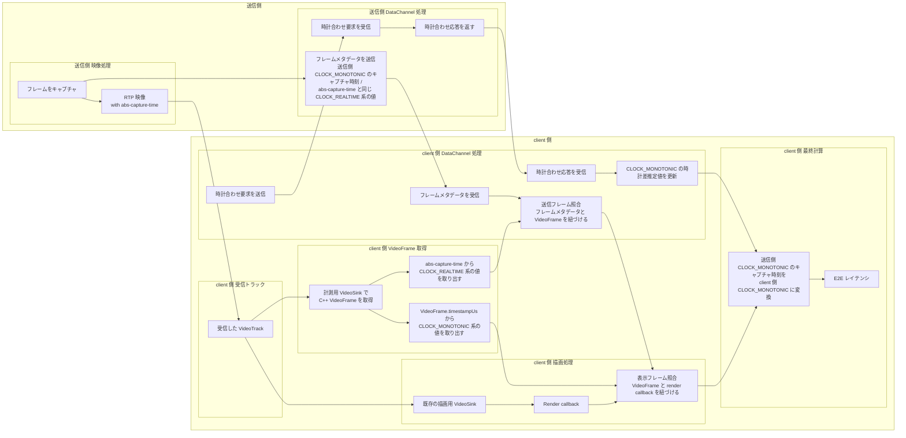

# WebRTC の E2E レイテンシはどう測るのか: フレーム単位計測アーキテクチャの設計

## はじめに

こんにちは、田中です。ポケットサインでエンジニアとして働いています。普段は「ポケットサイン防災」という Web アプリの開発をしています。

その一方で、趣味として WebRTC を用いた PC と Android 間の画面共有システムを作っています。このシステムでは、PC 側の画面を Android 端末に配信し、離れた端末から操作できるようにしています。

この種のシステムでは、体感の良し悪しを議論するうえで、遅延の把握が欠かせません。そこで今回は、そのシステムにおける映像の end-to-end レイテンシをどのように測るか、そのためにどのような計測アーキテクチャを設計したかを紹介します。

## 1. 何を測りたかったのか

本稿で測りたかったのは、送信側でキャプチャされたフレームが Android クライアントで表示されるまでの時間です。起点は送信側のキャプチャ時刻、終点は受信側の描画時刻です。ネットワークだけでなく、エンコード、伝送、デコード、描画までを含めた end-to-end の時間を対象にします。

単純に考えれば、描画時刻からキャプチャ時刻を引くだけです。ただし実際に計測しようとすると、送信側のキャプチャ時刻と受信側の描画時刻はそのままでは比較できません。加えて、後述する Java API の問題によって、送信側で記録した時刻と受信側で観測したフレームを簡単に結び付けることもできません。計測を成立させるには、少なくとも次の 2 つの条件が必要です。

1. その 2 つの時刻を同じ時間軸で比較できること
2. 送信側と受信側で同じフレームを対応付けられること

前者は時刻同期の問題であり、後者はフレーム同定の問題です。WebRTC の E2E レイテンシ計測では、この 2 つを同時に満たす必要があります。次章では、なぜ素朴な方法ではそれが難しいのかを整理します。

## 2. なぜ素朴には測れないのか

### 2.1 送信側と受信側の時刻はそのままでは比較できない

最初の問題は時間軸です。送信側で記録するキャプチャ時刻と、Android クライアントで記録する描画時刻は、別のデバイスで取得された時刻であり、同じ基準でそのまま比較することはできません。

この状態では、送信側で得た値を受信側の値からそのまま引くことはできません。E2E レイテンシを計算するには、まず送信側の時刻を受信側の時間軸に対応付ける必要があります。

### 2.2 同じフレームを特定することが難しい

次の問題はフレーム同定です。E2E レイテンシは「送信側でそのフレームがいつキャプチャされたか」と「受信側でそのフレームがいつ表示されたか」の差なので、まず両者が同じフレームを指している必要があります。

素朴に考えると、Android 側で「いま描画されようとしているフレーム」を見つけて、そのフレームが送信側でいつキャプチャされたものなのかを分かれば十分に見えます。つまり、受信側で見えている 1 枚のフレームに対して、「いつのフレームなのか」と「いつ描画されたのか」を結び付けられればよさそうです。

しかし、Android アプリケーションコードから見えているのは、libwebrtc の C++ 側で扱われているフレーム情報のうち、Java API へ公開されている部分だけです。今回ほしかった送信側 capture 時刻に由来する情報は、その公開範囲には含まれていませんでした。

つまり、Java 側では「いま描画されようとしているフレーム」は見えても、それが送信側でいつキャプチャされたフレームなのかまでは分かりません。そのため、フレーム同定を成立させるには、C++ 側で保持されているフレーム情報を取得できる、より下位の層を扱う必要がありました。

## 3. 採用した計測パイプラインの全体像

### 3.1 計測値が成立するまでの流れ

この計測では、時計合わせとフレームの対応付けが別々に進み、最後に合流します。DataChannel だけでも RTP だけでも完結しません。そのため、先に「どの情報がどの経路を流れ、どこで同じフレームへ紐づくか」を全体図で示します。

この図は、DataChannel で時計差を推定する経路、RTP と `VideoTrack` を通ってフレームを受け取る経路、描画直前の callback で表示時刻を取得する経路の 3 本を最後に合流させて、E2E レイテンシを求める流れを表しています。図中の処理は、時計合わせ、フレーム受信と照合、描画との照合と最終計算の順に進みます。

### 3.2 図の理解に必要な前提

- `CLOCK_MONOTONIC` と `CLOCK_REALTIME` の違い
  - この図を読むうえで最も重要なのは、時間軸が 2 つあること。
  - `CLOCK_REALTIME` は壁時計に近い時刻で、NTP などによって補正されうる。
  - `CLOCK_MONOTONIC` は単調増加する経過時間用の時刻。
  - レイテンシ計測の最終計算に向くのは `CLOCK_MONOTONIC`。
  - 一方で、後述する `abs-capture-time` には絶対時刻系の値が載る仕様なので、送信フレーム照合では `CLOCK_REALTIME` 系の値を使っている。

- `abs-capture-time` が何者か
  - `abs-capture-time` は RTP header extension。
  - 送信側でそのフレームがいつキャプチャされたかに対応する絶対時刻系の情報を、RTP の映像パケットに載せて運ぶために使う。
  - ここに入るのは絶対時刻系の値であり、送信フレーム照合では `CLOCK_REALTIME` 系の値として使える。
  - client 側で、C++ 側の `VideoFrame` を直接受け取る計測用 `VideoSink` を追加すると、この値に由来する情報を取り出せる。
  - DataChannel で送るフレームメタデータにも、送信フレーム照合のためにこれと同じ `CLOCK_REALTIME` 系の値を含める。

- DataChannel を何に使っているのか
  - DataChannel では 2 種類の情報をやり取りする。
  - ひとつは時計合わせメッセージの送受信。
  - もうひとつは、送信側 `CLOCK_MONOTONIC` のキャプチャ時刻と、送信フレーム照合に使う `CLOCK_REALTIME` 系の値を含むフレームメタデータの受信。

- 時計合わせ要求 / 応答で何を推定しているのか
  - sender と client は別マシンなので、両者の `CLOCK_MONOTONIC` はそのまま比較できない。
  - そのため DataChannel の往復でオフセットを求め、送信側 `CLOCK_MONOTONIC` を client 側 `CLOCK_MONOTONIC` に写像できるようにする。
  - やっていることは NTP と同型の時計合わせであり、往復時間を使ってオフセットを見積もる。
  - 図の「送信側 `CLOCK_MONOTONIC` のキャプチャ時刻を client 側 `CLOCK_MONOTONIC` に変換」が成り立つ前提がこの時計差。

- フレーム照合が何を意味しているのか
  - フレーム照合は 2 段ある。
  - 送信フレーム照合
    - DataChannel で受け取ったフレームメタデータと、計測用 `VideoSink` で取得した `VideoFrame` を紐づける。
    - ここで使うのは `abs-capture-time` と同じ `CLOCK_REALTIME` 系の値。
    - これにより、送信側 `CLOCK_MONOTONIC` のキャプチャ時刻を、その `VideoFrame` に紐づけられる。
  - 表示フレーム照合
    - 送信フレーム照合で紐づいた `VideoFrame` と render callback を紐づける。
    - ここで使うのが `VideoFrame.timestampUs` に由来する `CLOCK_MONOTONIC` 系の値。
  - この 2 段を通すことで、「送信時刻」と「表示時刻」を同一フレーム単位で対応付けられる。

- `VideoTrack` / `VideoSink` / `VideoFrame` / render callback の関係
  - libwebrtc は受信した映像を `VideoTrack` として扱い、その先で複数の `VideoSink` にフレームを渡せる。
  - 今回のアプリでは、その `VideoTrack` に対して 2 つの経路を並行に持つ。
    - C++ 側で直接 `VideoFrame` を受け取る計測用 `VideoSink`
    - 既存の描画用 `VideoSink` から render callback へ進む経路
  - 最後にこの 2 経路を表示フレーム照合で同じフレームへ紐づける。

- `VideoFrame.timestampUs` が何の時刻なのか
  - `VideoFrame.timestampUs` は、client 側で受信後の `VideoFrame` に載っている時刻。
  - 送信側のキャプチャ時刻そのものではなく、送信フレーム照合には使わない。
  - この計測では、render callback 側の時刻と紐づけるための client 側 `CLOCK_MONOTONIC` 系のフレーム時刻になる。

---

## 付録A. libwebrtc と Android の API 事情

ここでいう `Android Java API` とは、Android アプリケーションコードから `org.webrtc` などを通して利用する公開 API 群を指しています。アプリ開発者は通常この層から `PeerConnection`、`DataChannel`、`VideoTrack`、`VideoSink`、`VideoFrame` などを扱います。

一方で、libwebrtc の本体は C++ で実装されています。メディア処理、RTP/RTCP、デコーダ周辺、各種メタデータの保持も主に C++ 側で行われます。つまり Android アプリが見ている Java API は、libwebrtc 全体をそのまま公開したものではなく、C++ 実装の一部を JNI 経由で利用するための窓口です。

この差は計測で効いてきます。アプリ側から `VideoFrame` を受け取れても、C++ 側では保持している追加情報まで同じ形で見えるとは限りません。今回必要だった `absolute_capture_time` や `packet_infos` のような情報は、その典型でした。

また、Android で libwebrtc を使う方法はひとつではありません。公式に近い `org.webrtc` を直接使う構成もあれば、その上に独自のラッパーや SDK を重ねる構成もあります。後者では、利用できる API がさらに限定されることがあります。

そのため、記事中で「Java API からは取れない」と書くときの意味は、「Android アプリケーションコードから通常アクセスできる公開 API だけでは、今回の計測に必要な情報へ到達できなかった」ということです。これは Java では絶対に不可能という意味ではなく、必要なら JNI やネイティブ側の観測点を設計する必要がある、という意味です。
