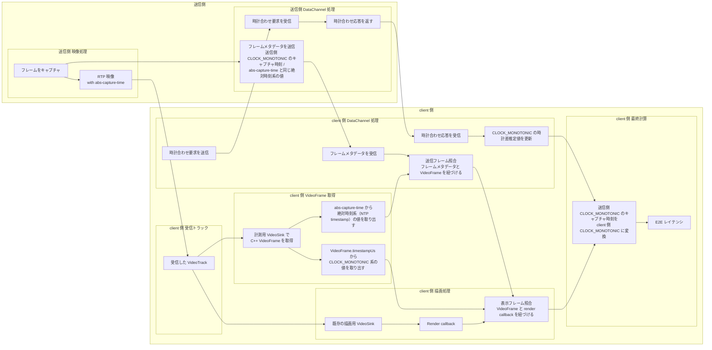

```mermaid
flowchart LR
    subgraph Sender["送信側"]
        direction TB

        subgraph SenderDC["送信側 DataChannel 処理"]
            SDC1[時計合わせ要求を受信]
            SDC2[時計合わせ応答を返す]
            SDC3[フレームメタデータを送信<br/>送信側 CLOCK_MONOTONIC のキャプチャ時刻 /<br/>abs-capture-time と同じ絶対時刻系の値]
        end

        subgraph SenderVideo["送信側 映像処理"]
            SV1[フレームをキャプチャ]
            SV2[RTP 映像<br/>with abs-capture-time]
        end
    end

    subgraph Client["client 側"]
        direction TB

        subgraph ClientDC["client 側 DataChannel 処理"]
            CDC1[時計合わせ要求を送信]
            CDC2[時計合わせ応答を受信]
            CDC3[CLOCK_MONOTONIC の時計差推定値を更新]
            CDC4[フレームメタデータを受信]
            CDC5[送信フレーム照合<br/>フレームメタデータと VideoFrame を紐づける]
        end

        subgraph ClientTrack["client 側 受信トラック"]
            CT1[受信した VideoTrack]
        end

        subgraph ClientVideo["client 側 VideoFrame 取得"]
            CV1[計測用 VideoSink で<br/>C++ VideoFrame を取得]
            CV2[abs-capture-time から<br/>絶対時刻系（NTP timestamp）の値を取り出す]
            CV3[VideoFrame.timestampUs から<br/>CLOCK_MONOTONIC 系の値を取り出す]
        end

        subgraph ClientRender["client 側 描画処理"]
            CR0[既存の描画用 VideoSink]
            CR1[Render callback]
            CR2[表示フレーム照合<br/>VideoFrame と render callback を紐づける]
        end

        subgraph ClientCalc["client 側 最終計算"]
            CC1[送信側 CLOCK_MONOTONIC のキャプチャ時刻を<br/>client 側 CLOCK_MONOTONIC に変換]
            CC2[E2E レイテンシ]
        end
    end

    SV1 --> SDC3
    SV1 --> SV2
    CDC1 --> SDC1
    SDC1 --> SDC2
    SDC2 --> CDC2
    CDC2 --> CDC3
    SDC3 --> CDC4
    CDC4 --> CDC5
    SV2 --> CT1
    CT1 --> CV1
    CT1 --> CR0
    CV1 --> CV2
    CV1 --> CV3
    CV2 --> CDC5
    CR0 --> CR1
    CDC5 --> CR2
    CV3 --> CR2
    CR1 --> CR2
    CDC3 --> CC1
    CR2 --> CC1
    CC1 --> CC2
```