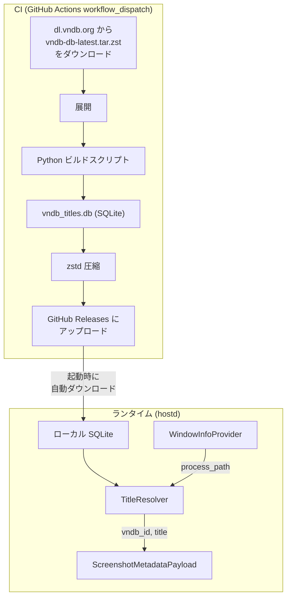

# ゲームタイトル推定: Rust 組み込み設計

> [!NOTE]
> アルゴリズム・スコアリングの詳細は [identify-title-flow.md](file:///f:/workspace/remoterg/identify-title-flow.md) を参照。本ドキュメントでは **Rust 側のアーキテクチャ、データフロー、辞書データの配布・更新方式** に焦点を当てる。

---

## 全体アーキテクチャ



---

## 1. 辞書データ形式: SQLite

### なぜ SQLite か

| 観点 | SQLite | フラットファイル (CSV/JSON) | 組み込み HashMap |
|---|---|---|---|
| 起動時間 | ファイルオープンのみ（即座） | パース＋辞書構築が必要（数秒） | パース＋構築が必要 |
| メモリ使用量 | 必要な行だけ読む | 全データをメモリに載せる | 全データ＋ハッシュ構造 |
| 包含検索 | LIKE で可能 | 自前実装 | フルスキャン |
| 更新 | ファイル差し替えのみ | ファイル差し替えのみ | 再構築が必要 |
| ツール | DB Browser 等で閲覧可 | テキストエディタ | デバッグ困難 |

### テーブル設計

```sql
-- 正規化済み辞書エントリ
CREATE TABLE dict_entries (
    id INTEGER PRIMARY KEY AUTOINCREMENT,
    normalized_name TEXT NOT NULL,  -- 正規化済み名前 (小文字、記号除去済み)
    no_space_name TEXT NOT NULL,    -- スペース除去版 (スペース無視マッチ用)
    game_id TEXT NOT NULL,          -- "v60196" 等
    match_type TEXT NOT NULL,       -- "title", "brand", "title:generated" 等
    original_name TEXT NOT NULL     -- 元の名前 (表示・デバッグ用)
);

CREATE INDEX idx_normalized ON dict_entries(normalized_name);
CREATE INDEX idx_no_space ON dict_entries(no_space_name);
CREATE INDEX idx_game_id ON dict_entries(game_id);

-- ゲームのメタデータ (結果表示用)
CREATE TABLE games (
    game_id TEXT PRIMARY KEY,
    official_title TEXT NOT NULL
);

-- メタデータ
CREATE TABLE metadata (
    key TEXT PRIMARY KEY,
    value TEXT NOT NULL
);
-- INSERT INTO metadata VALUES ('version', '2026-02-28');
-- INSERT INTO metadata VALUES ('entry_count', '340000');
```

### 包含マッチの戦略

初期実装は `LIKE '%token%'` によるフルスキャンで対応。トークン数は 5〜10 個程度で、プロセスパス変更時にのみ実行されるため性能上の問題は生じない見込み。問題が生じた場合は FTS5 への切り替えを検討する。

---

## 2. 辞書データのライフサイクル

### 2-1. ビルド（CI による辞書生成）

GitHub Actions の `workflow_dispatch` で手動トリガーする CI ワークフローを作成。

```yaml
# .github/workflows/build-title-db.yml (概要)
on:
  workflow_dispatch:

jobs:
  build:
    runs-on: ubuntu-latest
    steps:
      # 1. VNDB ダンプをダウンロード
      - run: curl -L https://dl.vndb.org/dump/vndb-db-latest.tar.zst -o vndb-db.tar.zst

      # 2. 展開
      - run: tar --zstd -xf vndb-db.tar.zst

      # 3. Python スクリプトで SQLite を生成
      - run: uv run python scripts/build_title_db.py

      # 4. zstd 圧縮
      - run: zstd vndb_titles.db -o vndb_titles.db.zst

      # 5. GitHub Release を作成してアップロード
      - uses: softprops/action-gh-release@v2
        with:
          tag_name: vndb-dict-${{ github.run_number }}
          files: vndb_titles.db.zst
```

**Python ビルドスクリプト** (`scripts/build_title_db.py`):
- 既存の `identify_title.py` の `TitleDictionary` / `load_vndb_dictionary()` を流用
- 辞書構築後に SQLite の `dict_entries` / `games` テーブルに INSERT
- メタデータ（バージョン日付、エントリ数）を記録

### 2-2. hostd 起動時のフロー

```
hostd 起動
    │
    ▼
ローカルに vndb_titles.db がある？
    │
    ├─ YES → TitleResolver を初期化して起動継続
    │
    └─ NO → GitHub Releases から最新版をダウンロード (起動をブロック)
             │
             └─ ダウンロード完了 → TitleResolver を初期化して起動継続
```

> [!IMPORTANT]
> 辞書が存在しない場合は **起動をブロックしてダウンロードを待つ**。辞書なしでの動作は想定しない。
> ダウンロードに失敗した場合はエラーログを出力して起動を続行する（タイトル推定は無効化）。

### 保存場所

```
Windows: %APPDATA%/remoterg/vndb_titles.db
```

---

## 3. Rust クレート構成

### 新規クレート: `title-resolver`

```
desktop/services/title-resolver/
├── Cargo.toml
└── src/
    ├── lib.rs          -- 公開 API
    ├── tokenizer.rs    -- Step 1-2: パスセグメント抽出 + トークン生成
    ├── matcher.rs      -- Step 3: SQLite 辞書マッチング
    ├── scorer.rs       -- Step 4: スコアリング
    ├── normalize.rs    -- 正規化ロジック
    └── downloader.rs   -- 辞書ダウンロード
```

**依存関係:**
- `rusqlite` (bundled) — SQLite バインディング
- `reqwest` — HTTP ダウンロード
- `unicode-normalization` — NFKC 正規化
- `regex` — トークン生成
- `tokio` — 非同期ダウンロード
- `tracing` — ログ

**他クレートへの依存は避ける** (`core-types` のみ許可)。

### 公開 API

```rust
/// タイトル推定結果
pub struct TitleResolveResult {
    pub vndb_id: String,          // "v60196"
    pub official_title: String,   // "流星ワールドアクター Gaslight Bullet"
    pub confidence: f64,          // 0.0〜1.0+
}

/// タイトル推定サービス
pub struct TitleResolver { /* ... */ }

impl TitleResolver {
    /// SQLite ファイルから TitleResolver を構築
    pub fn new(db_path: &Path) -> Result<Self>;

    /// プロセスパスからゲームタイトルを推定
    pub fn resolve(&self, process_path: &str) -> Option<TitleResolveResult>;
}

/// 辞書ダウンローダー
pub struct DictDownloader { /* ... */ }

impl DictDownloader {
    /// GitHub Releases から最新の辞書をダウンロードして保存
    pub async fn ensure_latest(dest: &Path) -> Result<()>;
}
```

---

## 4. hostd への組み込み

### 4-1. InputService への統合

```rust
pub struct InputService {
    // ... 既存フィールド
    title_resolver: Arc<TitleResolver>,   // 追加（起動時に必ず初期化）
    cached_title: Option<(String, TitleResolveResult)>,  // (process_path, result) キャッシュ
}
```

`handle_screenshot_request` 内:

```rust
let process_path = window_info.as_ref().map(|i| i.process_path.clone());

// キャッシュチェック
let title_info = if let Some(ref path) = process_path {
    if let Some((ref cached_path, ref cached_result)) = self.cached_title {
        if cached_path == path {
            Some(cached_result.clone())
        } else {
            let result = self.title_resolver.resolve(path);
            self.cached_title = result.as_ref().map(|r| (path.clone(), r.clone()));
            result
        }
    } else {
        let result = self.title_resolver.resolve(path);
        self.cached_title = result.as_ref().map(|r| (path.clone(), r.clone()));
        result
    }
} else {
    None
};

let metadata = ScreenshotMetadataPayload {
    // ... 既存フィールド
    vndb_id: title_info.as_ref().map(|t| t.vndb_id.clone()),
    official_title: title_info.as_ref().map(|t| t.official_title.clone()),
};
```

### 4-2. core-types の変更

```rust
pub struct ScreenshotMetadataPayload {
    // ... 既存フィールド
    pub vndb_id: Option<String>,         // 追加
    pub official_title: Option<String>,  // 追加
}
```

### 4-3. 起動時のフロー (main.rs)

```rust
// 辞書のパスを決定
let dict_path = dirs::data_dir()
    .unwrap_or_else(|| PathBuf::from("."))
    .join("remoterg")
    .join("vndb_titles.db");

// 辞書が存在しない場合はダウンロード（起動をブロック）
if !dict_path.exists() {
    info!("VNDB 辞書が見つかりません。ダウンロードを開始します...");
    match DictDownloader::ensure_latest(&dict_path).await {
        Ok(()) => info!("辞書のダウンロード完了"),
        Err(e) => tracing::error!("辞書のダウンロードに失敗: {}", e),
    }
}

// TitleResolver の初期化
let title_resolver = Arc::new(TitleResolver::new(&dict_path)?);
```

---

## 5. テスト計画

### 5-1. Python ビルドスクリプトのテスト

- **辞書生成の妥当性テスト**: 生成された SQLite を PoC (`identify_title.py`) と同じテストケースに通し、マッチ結果を比較
- 具体的には、PoC の `main()` と同等の処理を SQLite 経由で行い、結果が一致することを検証

### 5-2. Rust `title-resolver` の単体テスト

テスト用の小規模な SQLite 辞書をテストコード内で生成し（`rusqlite::Connection::open_in_memory()`）、各モジュールを個別にテスト。

#### tokenizer のテスト

`identify-title-flow.md` の Case 1〜6 をそのままテストケースとする:

```rust
#[test]
fn test_extract_segments_case1() {
    let segments = extract_segments(r"G:\game\Heliodor\流星ワールドアクターGB\WorldActorGB.exe");
    assert_eq!(segments, vec!["Heliodor", "流星ワールドアクターGB", "WorldActorGB"]);
}

#[test]
fn test_generate_tokens_case1() {
    let tokens = generate_tokens(&["流星ワールドアクターGB"]);
    assert!(tokens.contains(&("流星ワールドアクター GB".to_string(), "Rule D")));
}
```

#### normalize のテスト

```rust
#[test]
fn test_normalize() {
    assert_eq!(normalize("FuriKuru_Game"), "furikuru game");
    assert_eq!(normalize("Ｆｕｌｌ　Ｗｉｄｔｈ"), "full width");
    assert_eq!(normalize("流星ワールドアクター: GB"), "流星ワールドアクター gb");
}
```

#### matcher のテスト

インメモリ SQLite にテスト用辞書を構築し、各マッチ方法の正しさを検証:

```rust
#[test]
fn test_exact_match() {
    let db = setup_test_db(&[("heliodor", "v1", "brand", "Heliodor")]);
    let results = match_token(&db, "Heliodor");
    assert_eq!(results[0].match_method, "exact");
    assert_eq!(results[0].score, 1.0);
}

#[test]
fn test_token_in_name() {
    let db = setup_test_db(&[("流星ワールドアクター gaslight bullet", "v60196", "title", "流星ワールドアクター Gaslight Bullet")]);
    let results = match_token(&db, "流星ワールドアクター");
    assert_eq!(results[0].match_method, "token_in_name");
}
```

#### scorer のテスト

```rust
#[test]
fn test_cross_bonus() {
    // title + brand の両方がヒットした場合にボーナスが付与されることを検証
}

#[test]
fn test_overlapping_penalty() {
    // 無印版と拡張版が両方ヒットした場合に無印版にペナルティが掛かることを検証
}
```

#### E2E テスト (`TitleResolver::resolve` の統合テスト)

テスト用 SQLite をフィクスチャとして用意し、PoC の Case 1〜6 に対応する入力パスで正しいタイトルが推定されることを検証:

```rust
#[test]
fn test_resolve_case1() {
    let resolver = TitleResolver::new(test_fixture_db_path()).unwrap();
    let result = resolver.resolve(r"G:\game\Heliodor\流星ワールドアクターGB\WorldActorGB.exe");
    assert!(result.is_some());
    let r = result.unwrap();
    assert_eq!(r.vndb_id, "v60196");
    assert!(r.confidence > 0.9);
}

#[test]
fn test_resolve_case2() {
    let resolver = TitleResolver::new(test_fixture_db_path()).unwrap();
    let result = resolver.resolve(r"G:\game\いつか、届く、あの空に。\main.bin");
    assert!(result.is_some());
    assert_eq!(result.unwrap().vndb_id, "v97"); // 対応するVNDB ID
}
```

> [!TIP]
> E2E テスト用のフィクスチャ SQLite は、`build_title_db.py` で生成した本番 DB からテストに必要な数十件のみを抽出した小規模版を `title-resolver/tests/fixtures/` に配置する。CI でも軽量に実行可能。

### 5-3. CI ワークフローのテスト

- `build-title-db.yml` の動作確認は手動で `workflow_dispatch` を実行して検証
- 生成された `vndb_titles.db.zst` のサイズ・エントリ数を確認

---

## 6. 実装の段階

### Phase 2-A: Python で SQLite 辞書を生成 + CI ワークフロー

1. `scripts/build_title_db.py` を作成
2. `.github/workflows/build-title-db.yml` を作成
3. ワークフローを実行して GitHub Releases に辞書を公開

### Phase 2-B: Rust `title-resolver` クレートの実装

1. `title-resolver` クレートを新設
2. `tokenizer`, `normalize`, `matcher`, `scorer` モジュールを実装
3. 上記テスト計画に基づくユニットテスト + E2E テスト

### Phase 2-C: hostd への組み込み

1. `core-types` に `vndb_id` / `official_title` フィールド追加
2. `input` サービスに `TitleResolver` を統合
3. 起動時の辞書ダウンロード + `DictDownloader` の実装
4. E2E テスト: 実際のゲームパスでの動作確認
