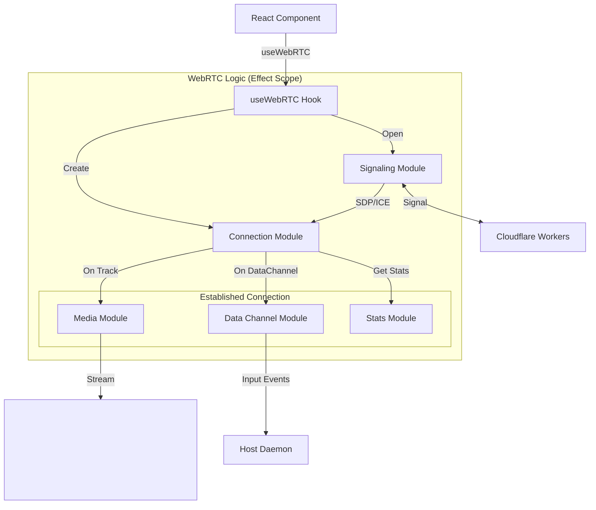

# WebRTC クライアントモジュール

このディレクトリには、RemoteRGのWebRTCクライアント実装が含まれています。
肥大化しがちなWebRTCのロジックを機能ごとにモジュール分割し、[Effect](https://effect.website/) ライブラリを使用して堅牢な非同期処理とエラーハンドリングを実現しています。

## アーキテクチャ

`use-webrtc.ts` フックがこれらのモジュールを統合し、Reactコンポーネントにインターフェースを提供します。
各モジュールは単一の責任を持ち、`Effect` を返却することで、依存関係の注入やライフサイクル管理（クリーンアップなど）を統一的に扱っています。

### モジュール構成

| ファイル            | 役割                                                                  |
| ------------------- | --------------------------------------------------------------------- |
| **signaling.ts**    | WebSocketを使用したシグナリングサーバーとの通信 (SDP/ICEの交換).      |
| **connection.ts**   | `RTCPeerConnection` の生成、設定、ライフサイクル管理.                 |
| **data-channel.ts** | DataChannelの確立とメッセージ送受信 (入力操作、デバッグコマンドなど). |
| **media.ts**        | 受信したトラック (Video/Audio) のハンドリング.                        |
| **stats.ts**        | WebRTC統計情報 (ビットレート、RTTなど) の定期的な収集.                |
| **mock.ts**         | 開発用のモック実装.                                                   |

## シーケンスと依存関係

`useWebRTC` フック内で `Effect.gen` を使用して、以下のフローで接続を確立します。

1. **Signaling**: WebSocket接続を確立。
2. **Connection**: `RTCPeerConnection` を作成。
3. **Loop**: シグナリングメッセージを監視し、SDP/ICE Candidateを交換してP2P接続を確立。
4. **Parallel**: 接続確立後、DataChannelの監視、トラックの受信、統計情報の収集を並行して実行。

## エラーハンドリング

Effectの強力なエラーハンドリング機構により、WebSocketの切断やWebRTCのネゴシエーションエラーなどの障害を構造的に捕捉し、リトライやグレースフルな切断を行うことができます。
